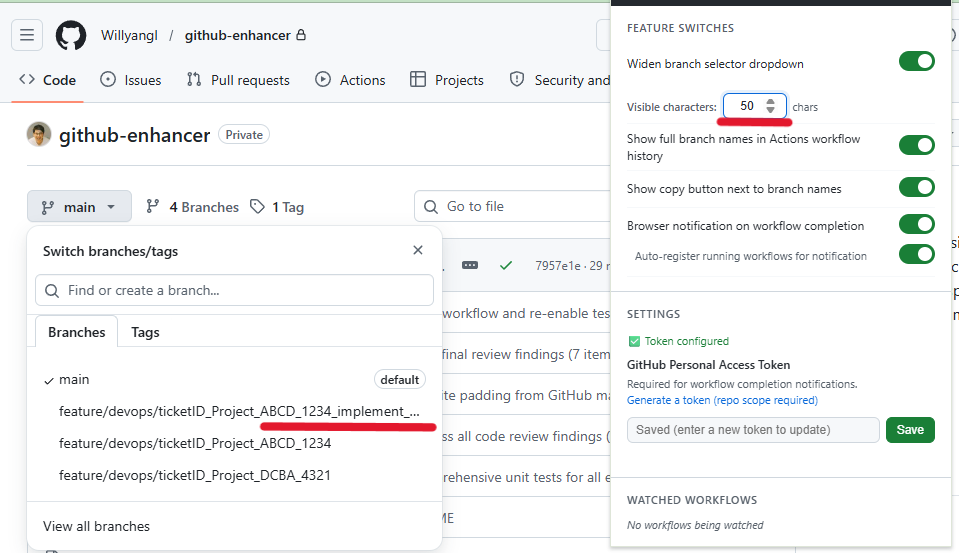
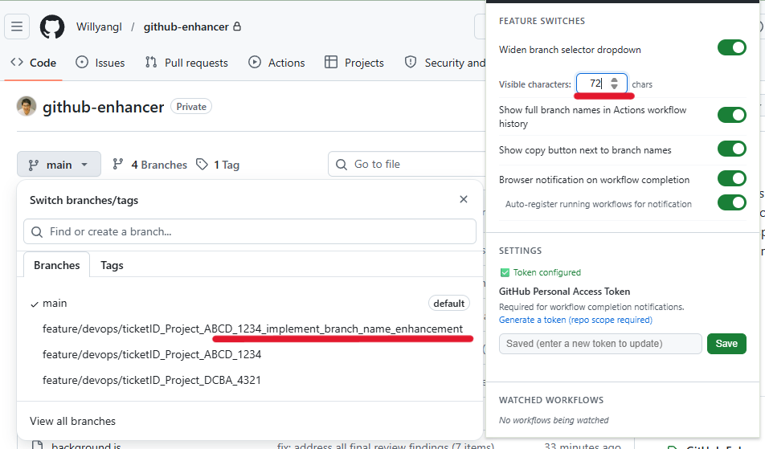
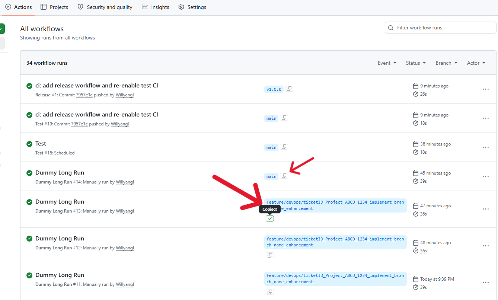
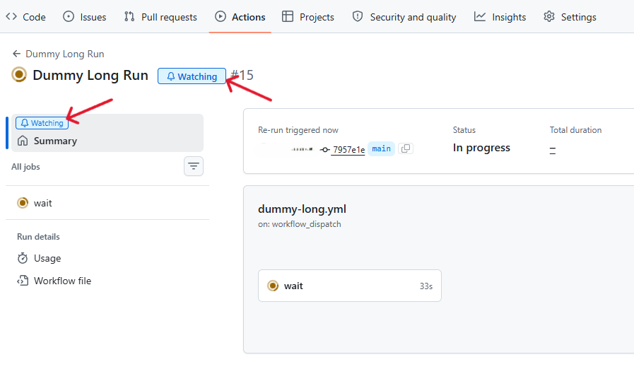
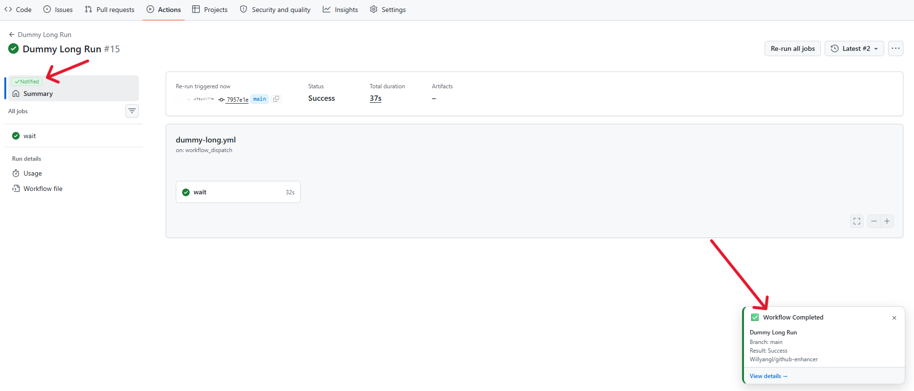
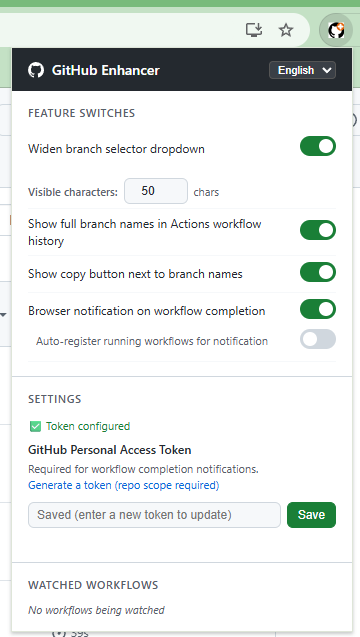

# GitHub UI/UX Enhancer

[](https://github.com/Willyangl/github-uiux-enhancer/actions/workflows/test.yml)

Microsoft Edge / Chrome 向けブラウザ拡張機能。GitHubの使い勝手を改善します。

## 機能

### 1. ブランチ選択プルダウンの幅拡大
リポジトリ画面・GitHub Actions の「Run workflow」モーダルなど、GitHub全体のブランチ選択プルダウンの幅を拡大します。表示文字数はポップアップから設定可能（20〜120文字、デフォルト50文字）。レガシーSelectMenuと最新Primer SelectPanel（React Portal）の両方に対応。

| Before | After |
|--------|-------|
|  |  |

### 2. Actionsワークフロー履歴のブランチ名を全表示 + コピーボタン
GitHub Actions のワークフロー一覧で、ブランチ名が省略されて見えない問題を解消します。列幅に合わせて自動改行し、全文を表示します。ブランチ名の横にワンクリックコピーボタンも追加。



### 3. ワークフロー完了通知
- **一覧画面 / 詳細画面**: 実行中ワークフロー行に「通知」ボタンを表示。クリックで通知登録。
- **自動通知登録**: ポップアップで有効化すると、実行中WFを自動的に通知登録。
- **完了通知**: ページ内トースト通知（右下）+ OS デスクトップ通知の2段構え。
- **通知クリック**: OS通知をクリックすると該当ワークフロー画面を開く。
- **通知完了表示**: 完了後はボタンが「通知完了」（非活性・緑色）に変わる。





### 4. 多言語対応
日本語・英語・中国語をサポート。ポップアップのヘッダーから即座に切り替え可能。初回起動時はブラウザの言語設定から自動判定。

### 5. 各機能の有効/無効スイッチ
ポップアップから各機能を個別にON/OFF切り替え可能。設定は即座に反映されます。



## インストール方法

### Chrome Web Store
（審査通過後にリンクを掲載予定）

### Edge（開発版）

1. `edge://extensions/` を開く
2. **「開発者モード」** をオンにする
3. **「展開して読み込む」** をクリック
4. このリポジトリのフォルダを選択

### Chrome（開発版）

1. `chrome://extensions/` を開く
2. **「デベロッパーモード」** をオンにする
3. **「パッケージ化されていない拡張機能を読み込む」** をクリック
4. このリポジトリのフォルダを選択

## 通知機能のセットアップ

ワークフロー完了通知を使うには **GitHub Personal Access Token** が必要です。

1. 拡張機能アイコンをクリックしてポップアップを開く
2. [GitHub トークン発行ページ](https://github.com/settings/tokens/new?scopes=repo&description=GitHub+Enhancer) でトークンを作成（`repo` スコープが必要）
3. トークンをポップアップの入力欄に貼り付けて「保存」

トークンはブラウザの `chrome.storage.local` に保存され、GitHub API へのリクエスト認証に使用されます。外部には送信されません。

## ファイル構成

```
github-enhancer/
├── manifest.json       # 拡張機能マニフェスト（Manifest V3）
├── content.js          # コンテンツスクリプト（機能1〜3のDOM操作）
├── background.js       # サービスワーカー（APIポーリング・通知）
├── popup.html          # 設定ポップアップ UI
├── popup.js            # 設定ポップアップ ロジック
├── styles.css          # CSS（プルダウン幅・ブランチ名・ボタン・トースト）
├── i18n.js             # 多言語モジュール（ja/en/zh）
├── i18n/
│   ├── ja.json         # 日本語翻訳
│   ├── en.json         # 英語翻訳
│   └── zh.json         # 中国語翻訳
├── icons/
│   ├── icon16.png
│   ├── icon48.png
│   └── icon128.png
├── docs/               # スクリーンショット
├── test/               # Jest ユニットテスト（106テストケース）
└── .github/workflows/
    ├── test.yml        # テストCI（push to main, PR）
    └── release.yml     # リリースCI（v*タグでZIP+GitHubリリース作成）
```

## 開発

```bash
# 依存関係インストール
npm install

# テスト実行
npm test
```

### リリース

```bash
git tag v1.1.0
git push origin v1.1.0
# → GitHub Actions: テスト → ZIP作成 → GitHubリリース作成
```

## 注意事項

- GitHub の UI は随時変更されるため、セレクタが一致しなくなる場合があります。その際は `content.js` のセレクタを調整してください。
- GitHub Personal Access Token はブラウザのローカルストレージに保存されます。共有PCでの使用には注意してください。
- バックグラウンドワーカーは1分間隔でGitHub APIをポーリングします（監視対象がない場合は自動停止）。API Rate Limit（5,000回/時）にご注意ください。
